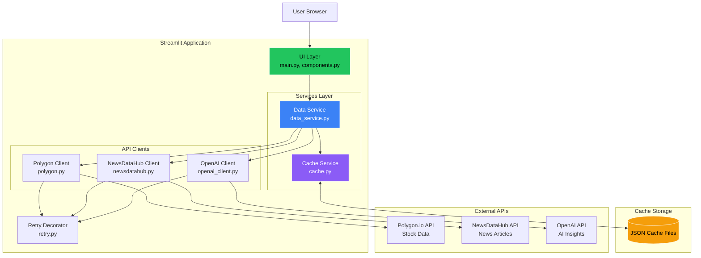

# Multi-API Financial Dashboard

A Streamlit dashboard demonstrating resilient patterns for integrating multiple APIs with caching, retry logic, and graceful error handling.

  

## Table of Contents

- [Demo](#demo)
- [Overview](#overview)
- [Features](#features)
- [Resilient Design Patterns](#resilient-design-patterns)
- [Architecture](#architecture)
- [Prerequisites](#prerequisites)
- [Installation](#installation)
- [Running the Application](#running-the-application)
- [Background Refresh Mode](#background-refresh-mode)
- [Testing](#testing)
- [Project Structure](#project-structure)
- [Configuration](#configuration)
- [Troubleshooting](#troubleshooting)
- [License](#license)

## Demo


*Demo showing real-time stock data, news feed, and AI-generated insights*

## Overview

This financial dashboard aggregates real-time stock data, news articles, and AI-generated insights for Netflix (NFLX), Alphabet (GOOGL), and Tesla (TSLA). Built to demonstrate resilient API integration patterns with smart caching and graceful degradation.

**Disclaimer:** This application is for educational and demonstration purposes only. It does not provide financial, investment, legal, or professional advice. Stock data and AI-generated insights should not be used as the basis for any investment decisions. Always consult with qualified financial professionals before making investment decisions. The developers are not responsible for any financial losses or damages resulting from the use of this application.

### Key Features

- **Multi-API integration** with Polygon.io, NewsDataHub, and OpenAI
- **Smart caching** with configurable TTL and stale data fallback
- **Retry logic** with exponential backoff (429 rate limits: 15s/30s/45s, other errors: 0.5s/1s/2s)
- **Graceful degradation** when APIs fail
- **DRY refactoring** with generic `_fetch_with_cache()` method
- **Independent component loading** for better UX
- **Two deployment modes** (local interactive / background refresh for predictable API costs)

## Features

### Data Sources

- **Stock Prices** - Real-time pricing and 1-month historical charts via [Polygon.io](https://polygon.io) (now [Massive.com](https://massive.com))
- **Related Stocks** - Competitor stock prices with daily percentage changes
- **News Articles** - Curated financial news from mainstream sources via [NewsDataHub](https://newsdatahub.com)
- **AI Insights** - GPT-powered analysis combining price trends and news via [OpenAI](https://openai.com)

### Technical Highlights

- **Independent component loading** - Each section renders with separate loading states
- **Async API calls** - Non-blocking HTTP requests using `httpx.AsyncClient`
- **Retry decorator** - Handles 429 rate limits (15s/30s/45s delays), 5xx/timeouts (0.5s/1s/2s delays)
- **Fresh vs. stale caching** - `get_fresh()` enforces TTL, `get_stale()` for fallback
- **JSON-based caching** - Human-readable cache files with automatic cleanup
- **Dynamic chart scaling** - Y-axis adjusts to actual price range
- **Brand colors** - Company-specific colors for tickers

## Resilient Design Patterns

### 1. Retry Logic with Intelligent Backoff

API clients use `@retry_with_backoff` decorator to handle transient failures:

```python
@retry_with_backoff(retry_on=(httpx.HTTPError,))
async def get_stock_data(self, ticker: str) -> dict:
    # Automatic retry on:
    # - 429 (rate limit) → 15s, 30s, 45s delays
    # - 5xx (server errors) → 0.5s, 1s, 2s delays
    # - Network timeouts → 0.5s, 1s, 2s delays
    # - Does NOT retry 4xx client errors (except 429)
```

### 2. DRY Refactoring with Generic Cache Handler

`DataService` uses a single `_fetch_with_cache()` method:

```python
async def _fetch_with_cache(self, cache_type, cache_key, fetch_fn, error_prefix):
    # 1. Check for fresh cached data
    # 2. Fall back to stale data if in background mode
    # 3. Fetch from API with retry
    # 4. Fall back to stale data on error

# Usage:
async def get_stock_data(self, ticker: str) -> dict:
    return await self._fetch_with_cache(
        cache_type="polygon",
        cache_key=ticker,
        fetch_fn=lambda: self.polygon.get_stock_data(ticker),
        error_prefix="POLYGON"
    )
```

**Result:** Eliminated 90+ lines of duplicate code across methods.

### 3. Fresh vs. Stale Cache Strategy

Two retrieval methods with different TTL enforcement:

- **`get_fresh()`** - Returns data only if age < `CACHE_TTL_MINUTES` (10 minutes default)
- **`get_stale()`** - Returns data regardless of age (used when API calls fail)

## Architecture



## Prerequisites

- **Python 3.9+**
- **API Keys** (Polygon and NewsDataHub have free tiers):
  - [Polygon.io](https://polygon.io) (now [Massive.com](https://massive.com)) - Stock data
  - [NewsDataHub](https://newsdatahub.com) - News
  - [OpenAI](https://platform.openai.com) - AI insights

## Installation

### 1. Clone and Setup

```bash
git clone https://github.com/your-username/multi-api-financial-dashboard.git
cd multi-api-financial-dashboard
python -m venv venv
source venv/bin/activate  # Windows: venv\Scripts\activate
pip install -r requirements.txt
```

### 2. Configure Environment

```bash
cp .env.example .env
```

Edit `.env` with your API keys:

```env
POLYGON_API_KEY=your_polygon_api_key_here
NEWSDATAHUB_API_KEY=your_newsdatahub_api_key_here
OPENAI_API_KEY=your_openai_api_key_here

# Optional settings
CACHE_TTL_MINUTES=10
LOG_LEVEL=INFO
```

## Running the Application

```bash
streamlit run app/main.py
```

Opens at `http://localhost:8501`

### Usage

1. Select a stock (NFLX, GOOGL, or TSLA)
2. View real-time price with percentage change
3. Explore 1-month price chart
4. See related competitor stocks
5. Read latest news (5 articles)
6. Generate AI insights (button click)

### Cache Behavior

First load fetches fresh data. Subsequent requests within TTL (10 minutes) serve from cache. Cache age indicators show when viewing cached data:

```
⏱️ Price data from 5m ago
```

## Background Refresh Mode

**Purpose:** Prevent unpredictable API costs in production.

### How It Works

**Local Mode** (`BACKGROUND_REFRESH=false`, default):
- User requests may trigger API calls when cache is stale
- API quota scales with user traffic

**Background Refresh Mode** (`BACKGROUND_REFRESH=true`):
- User requests never trigger API calls
- Separate cron job (`scripts/refresh_cache.py`) refreshes cache on fixed schedule
- API quota is constant regardless of traffic

### Configuration

Set in `.env`:
```env
BACKGROUND_REFRESH=true
```

Run refresh job via cron (every 3 hours):
```bash
0 */3 * * * /path/to/venv/bin/python /path/to/scripts/refresh_cache.py
```

**Tradeoff:** Data can be up to 3 hours stale, but API costs are predictable.

## Testing

```bash
# Run all tests
pytest

# With coverage
pytest --cov=app --cov-report=html --cov-report=term-missing

# Specific tests
pytest tests/test_cache.py
pytest tests/test_polygon.py
```

**Coverage:** ~25-30% focusing on configuration, cache operations, API transformations, and news deduplication.

## Project Structure

```
multi-api-financial-dashboard/
├── app/
│   ├── main.py                     # Streamlit entry point
│   ├── config.py                   # Configuration with validation
│   ├── api/                        # API clients with @retry_with_backoff
│   ├── services/                   # Cache and data orchestration
│   ├── ui/components.py            # UI components
│   └── utils/                      # Logging and retry decorator
├── scripts/refresh_cache.py        # Background refresh job
├── tests/                          # Test suite
├── cache/                          # JSON cache files (git-ignored)
├── .env.example                    # Environment template
└── requirements.txt                # Dependencies
```

## Configuration

Configure via environment variables (`.env`):

| Variable | Default | Description |
|----------|---------|-------------|
| `BACKGROUND_REFRESH` | `false` | If true, app only reads cache |
| `CACHE_TTL_MINUTES` | `10` | Cache freshness duration |
| `CACHE_MAX_AGE_HOURS` | `24` | Delete cache older than this |
| `POLYGON_API_KEY` | — | Required |
| `NEWSDATAHUB_API_KEY` | — | Required |
| `OPENAI_API_KEY` | — | Required |
| `LOG_LEVEL` | `INFO` | Logging verbosity |

## Troubleshooting

### Application won't start
- Verify all API keys in `.env`
- Check Python version (3.9+)
- Reinstall: `pip install -r requirements.txt`

### No data showing
- Check `logs/app.log` for errors
- Verify API keys are valid with quota remaining
- Test network connectivity

### Tests failing
- Ensure pytest installed
- Check file permissions
- Run with verbose: `pytest -v`

## License

MIT License - see LICENSE file for details.

## Resources

- [Polygon.io Documentation](https://polygon.io/docs) (now Massive.com)
- [NewsDataHub API Documentation](https://newsdatahub.com/docs)
- [OpenAI API Documentation](https://platform.openai.com/docs)
- [Streamlit Documentation](https://docs.streamlit.io)
